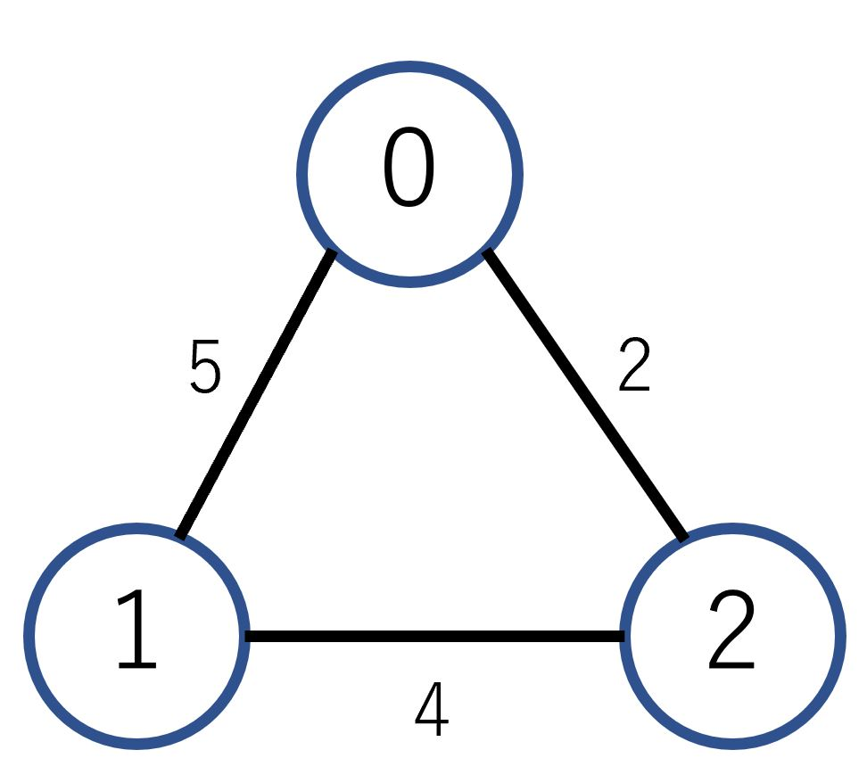
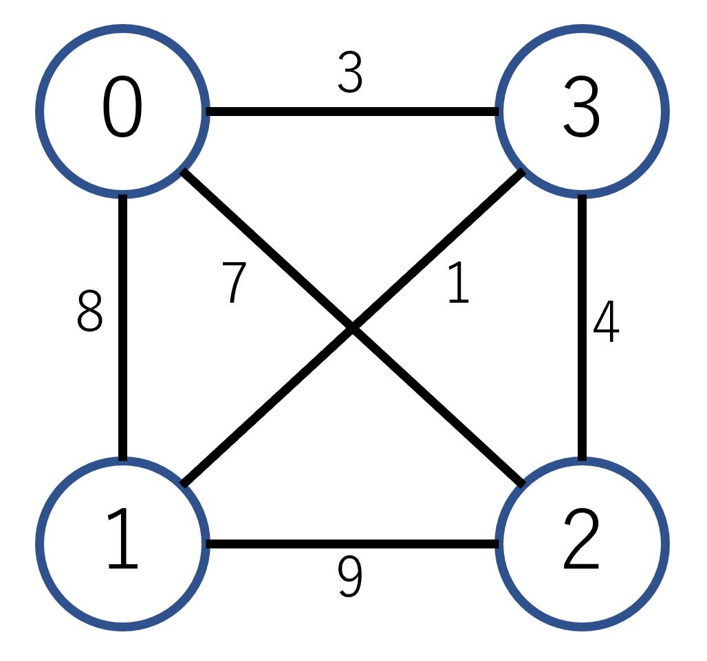

[](https://travis-ci.org/snst-lab/traveling-salesman-problem) 

traveling-salesman-problem
====
>A solution with Javascript to a typical Traveling Salesman Problem using bit operations and Dynamic Programming. 

<br>

 ## Description
 This is a famous problem of finding the shortest path when visiting multiple nodes only once.  
  The distance between nodes (movement cost between nodes) is given as a condition.

<br>

 ## Cost definition
 Cost definition is given with matrix & diagram.  
 The distance from node i to node j corresponds to the element of array `cost[i][j]`.

 ### Case1 : 3nodes
 

  ```js
const cost1=[
    [0,5,2],
    [5,0,4],
    [2,4,0]
];
 ```
<br>

 ### Case2 : 4nodes
 

 ```js
 const cost2=[
    [0,8,7,3],
    [8,0,9,1],
    [7,9,0,4],
    [3,1,4,0]
];
 ```
<br>

  ## Solver

 ### Define DP Matrix
 First, prepare a matrix for dynamic programming.
  ```js
  class DP{
	constructor(X,Y){
        this.array= Array(X).fill().map(e=>Array(Y).fill(Infinity));
        //In the case of TSP initialize with infinity
 		this.X=X; this.Y=Y;
	}
	_(x,y){ //setter
		const s = this; 
		return (x<0||y<0||x>=this.X||y>=this.Y) ? {set _(value){}}:{set _(value){s.array[x][y] = value;}} ;
	}
	$(x,y){ //getter
		return (x<0||y<0||x>=this.X||y>=this.Y) ? 0 : this.array[x][y];
	}
}
  ```

<br>

 ### Main Program

The state visiting the node i is expressed as `1<<i`  to make it easier to count the states. 
For example, the state of visiting nodes 1, 2 and 4 is expressed as `1011`.

>### When the departure node is not decided

 ```js
  function TSP(cost){
	const n = cost.length;
	const d = new DP(1<<n,n);
   
	for(var s=0; s<(1<<n); s++){       //A set of visited nodes s
		for(var i=0; i<n; i++){        //Full search for the last visited node i
			if(!(s&(1<<i))) continue;  //It can not be yet visited to the last visited node
			d._(1<<i,i)._ = 0;         //When starting from node i, the binary representation of the subset is 1 << i.
			for(var j=0; j<n; j++){    //Full search for the next visited node j 
				if(s&(1<<j)) continue; //It can not have already visited the next node to visit
				d._(s|(1<<j),j)._ = Math.min(d.$(s|(1<<j),j), d.$(s,i)+cost[i][j]);
			}
		}
	}
    return Math.min(...Array(n).fill().map((e,i)=> d.$((1<<n)-1, i))); 
    //Search for the minimum value from the state of visiting all nodes (s = 1111 ...)
}
```

<br>
<br>

>### When the departure node is decided

 ```js
function TSPfromStartNode(cost,startNode){
	const n = cost.length;
	const d = new DP(1<<n,n);

	d._(1<<startNode,startNode)._ = 0; //When starting from node startNode, the binary representation of the subset is 1 << startNode.
   
	for(var s=0; s<(1<<n); s++){       //A set of visited nodes s
		for(var i=0; i<n; i++){        //Full search for the last visited node i
			if(!(s&(1<<i))) continue;  //It can not be yet visited to the last visited node
			for(var j=0; j<n; j++){    //Full search for the next visited node j 
				if(s&(1<<j)) continue; //It can not have already visited the next node to visit
				d._(s|(1<<j),j)._ = Math.min(d.$(s|(1<<j),j), d.$(s,i)+cost[i][j]);
			}
		}
	}
    return Math.min(...Array(n).fill().map((e,i)=> d.$((1<<n)-1, i))); 
    //Search for the minimum value from the state of visiting all nodes (s = 1111 ...)
}

```

<br>

## Reference

>- [Qiita 「ビット演算 (bit 演算) の使い方を総特集！ 〜 マスクビットから bit DP まで 〜」](https://qiita.com/drken/items/7c6ff2aa4d8fce1c9361#%E5%B7%A1%E5%9B%9E%E3%82%BB%E3%83%BC%E3%83%AB%E3%82%B9%E3%83%9E%E3%83%B3%E5%95%8F%E9%A1%8C) 
<br>
>- [DPの話](http://d.hatena.ne.jp/Tayama/20111210/1323502092)

 